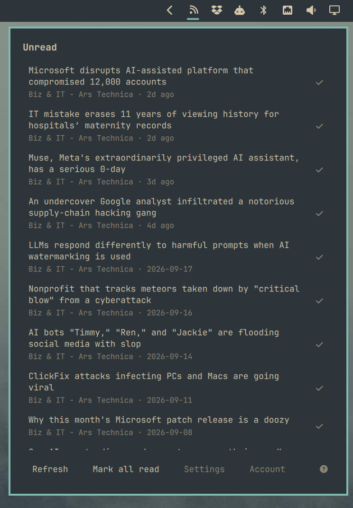

# Miniflux — Omarchy bar widget

The latest unread entries from your [Miniflux](https://miniflux.app) instance, in the
Omarchy bar. Click a title to read it in your browser, mark one entry read, or mark
everything the panel is showing read.



## Install

```sh
git clone <this repo> ~/.config/omarchy/plugins/anavarre.miniflux
omarchy plugin validate ~/.config/omarchy/plugins/anavarre.miniflux
omarchy plugin enable anavarre.miniflux
omarchy-shell shell rescanPlugins
omarchy bar move anavarre.miniflux --section right
```

Requires `curl` and `bash`, both of which Omarchy already has.

## Usage

The first click opens a sign-in form: the address of your instance, your Miniflux
username and your password. The password is used once, to mint an API key through
`POST /v1/api-keys`; only that key is stored. Instances older than Miniflux 2.2.9 have
no such endpoint, so there the password itself is kept instead.

Credentials live in `~/.config/omarchy/miniflux/` — a `config` file with the server and
username, and `token` (or `password`) alongside it, all `0600` in a `0700` directory.
"Forget credentials" in the panel deletes them; the API key stays on the Miniflux side
until you revoke it under Settings → API keys.

Environment variables take precedence over the stored files, if you would rather manage
them yourself: `MINIFLUX_SERVER`, `MINIFLUX_API_KEY`, or `MINIFLUX_USERNAME` plus
`MINIFLUX_PASSWORD`. `MINIFLUX_PLUGIN_DIR` moves the store.

Each row shows the entry title, with its feed and age underneath. Clicking the title
opens it in your default browser; the check button on the right marks that one entry
read; "Mark as read" marks the entries currently loaded in the panel and nothing
else — unread entries beyond the list are untouched, so a shorter list is also a
narrower action.

| key | |
|---|---|
| `j` / `k`, arrows | move the selection |
| `Enter` | open the selected entry |
| `x` | mark the selected entry read |
| `a` | mark the listed entries read |
| `r` | refresh |
| `c` | change credentials |
| `s` | save the selected entry to your Miniflux save integration |
| `,` | open settings |
| `Escape` | close |

## Settings

In the plugin's settings (Omarchy's plugin picker, or its entry in `~/.config/omarchy/shell.json`):

- **Entries to show** — how many entries the panel lists, 1 to 100 (default 10).
  Also in the panel's **Settings** section, which steps by one up to ten and by
  ten above it; the plugin's settings form takes any value in the range. Changing
  it refetches the list.
- **Refresh every (minutes)** — how often the list refreshes on its own: 30
  minutes, 1, 2, 3, 6, 12 or 24 hours (default 30 minutes). Also reachable from
  the panel's **Settings** button, which writes the same setting.
- **Text size** — Small, Medium, Large or Extra large; scales every piece of
  text in the panel. Also in the panel's **Settings** section, where picking a
  size redraws the panel at that size straight away.
- **Mark new entries on the bar** — on by default. When a background refresh
  turns up entries that were not in the previous list, a dot appears on the bar
  icon; opening the panel clears it. The first fetch after signing in only sets
  the baseline, so it never starts out dotted. Also in the panel's **Settings**
  section, as a switch.
- **Unread entries only** — off also lists entries you have already read.

## Remove

```sh
omarchy plugin disable anavarre.miniflux
rm -rf ~/.config/omarchy/plugins/anavarre.miniflux ~/.config/omarchy/miniflux
```

## License

[MIT](LICENSE).
